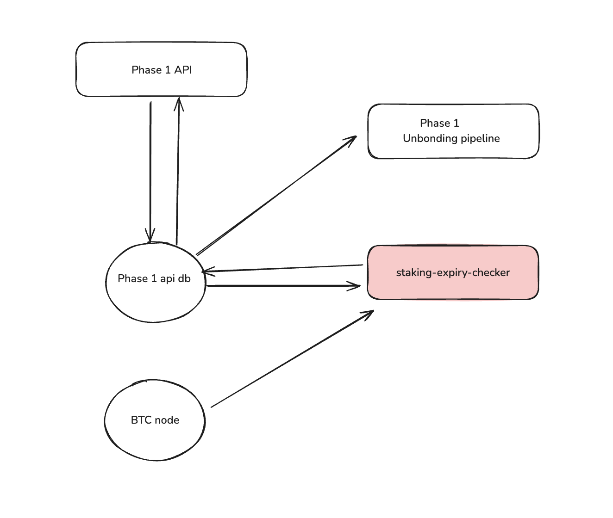

# Babylon Staking Expiry Checker

## Overview

The **Babylon Staking Expiry Checker** is a service that manages unbonding and withdrawal processes for Phase 1 delegations that haven't transitioned to Phase 2.

### Key Responsibilities

1. **Expiry Monitoring**: Identify when staking/unbonding timelock has expired, so delegation can be marked as Unbonded
2. **Unbonding Detection**: Identify when unbonding tx appeared in BTC, so delegation can be marked as Unbonding
3. **Withdrawal Tracking**: Identify when withdrawal tx appeared in BTC (staking/unbonding output has been spent through timelock path), and mark delegation as Withdrawn

## Architecture



The Staking Expiry Checker shares a database with other Phase 1 services and operates independently:

- **Shared MongoDB Database**: 
  - Read/Write access to the same database used by    Phase 1 API
  - Monitors and updates delegation states
- **Bitcoin Node**: Monitors BTC transactions for unbonding and withdrawal events

## Service Components

### 1. BTC Subscriber Poller
- Subscribes to Bitcoin spend notifications
- Monitors:
  - Staking transaction spends
  - Unbonding transaction spends
- Updates delegation states in shared database

### 2. Expiry Checker Poller
- Polls timelock queue table
- Identifies delegations with expired staking/unbonding timelocks
- Updates delegation status to "Unbonded" when timelock expires

## Installation & Setup

### Requirements

- **Go**: Version `1.23.1` or higher is required.
- **MongoDB**: A MongoDB instance with replica sets enabled is required

1. Clone the repository

```bash
git clone git@github.com:babylonlabs-io/staking-expiry-checker.git
cd staking-expiry-checker
```

2. Install dependencies

```bash
go mod tidy
```

3. Run the service

```bash
make run-local
```